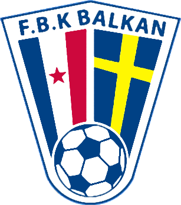

# FBK Balkan 

 

## Om klubben

**FBK Balkan** är en fotbollsklubb från Rosengård i Malmö. Klubben grundades den **22 november 1962** av jugoslaviska arbetskraftsinvandrare och har sedan starten varit en viktig mötesplats för integration och gemenskap genom fotboll.

Namnet "Balkan" valdes för att samla människor från hela Balkanregionen. Redan 1963 öppnade klubben upp för alla spelare oavsett bakgrund. Idag driver FBK Balkan en omfattande ungdomsverksamhet med lag från de yngsta åldrarna och är välkänd i Malmö för sitt starka sociala engagemang.

## Om projektet

Detta är mitt **LIA-projekt** (Lärande i Arbete) där jag från grunden byggt en ny webbplats för klubbens ungdomsverksamhet.

Webbplatsen är en fullstack-applikation som hjälper klubben att digitalisera och effektivisera hanteringen av:
- Provträningsregistrering
- Laghantering
- Nyheter och kommunikation
- Coach- och spelardata

---

## ✨ Funktioner

### Huvudfunktioner
- **Provträningsanmälan** – Enkel och modern registrering för nya spelare
- **Laghantering** – Skapa, redigera och hantera alla ungdomslag
- **Coachadministration** – Profiler och översikt över tränare
- **Nyhetssystem** – Publicera och hantera nyheter till spelare och föräldrar
- **Rollbaserad åtkomst** – Admin, Tränare och Publik
- **Filuppladdning** – Lagloggor och bilder
- **Responsiv design** – Fungerar bra på både mobil och dator

---

## 🛠️ Teknikstack

### Backend
- **Java 21**
- **Spring Boot 4.0.0**
- **Spring Security** (med rollhantering)
- **JPA + Hibernate**
- **Maven**

### Frontend
- **Thymeleaf** + **HTMX**
- **Tailwind CSS** + **DaisyUI**
- Responsiv och modern design

### Databas
- **SQLite** (`fbkbalkan.db`) : Dev
- **Postgresql** : Prod
 

---

## 🚀 Installation & Körning

### Förutsättningar
- Java 21
- Maven
- Node.js

### Steg-för-steg

```bash
# 1. Klona repositoryt
git clone https://github.com/RahimOnGit/FBK_Balkan.git
cd FBK_Balkan

# 2. Bygg projektet
./mvnw clean install

# 3. Starta applikationen
./mvnw spring-boot:run
```

Applikationen blir då tillgänglig på `http://localhost:8080`

---

## Projektstruktur

```
FBK_Balkan/
├── src/main/java/com/example/fbk_balkan/
│   ├── controller/      # MVC-controllers
│   ├── entity/          # Databasklasser
│   ├── repository/      # Databaslager
│   ├── service/         # Affärslogik
│   └── security/        # Säkerhetskonfiguration
├── src/main/resources/
│   ├── templates/       # Thymeleaf-sidor
│   └── static/          # CSS, JS, bilder
├── pom.xml
└── fbkbalkan.db         # SQLite-databas
```

---

## Status

Projektet är utvecklat som ett **LIA-projekt** under våren 2025-2026 och är klart för användning.

---

## Kontakt

**Rahim**  
GitHub: [@RahimOnGit](https://github.com/RahimOnGit)  

FBK Balkan  
Webbplats: [fbkbalkan.se](https://ungdom.fbkbalkan.se)

---

**Tack för att du tittar på projektet!** ⚽  
Ett projekt byggt med kärlek för en klubb som gör skillnad i Malmö.
